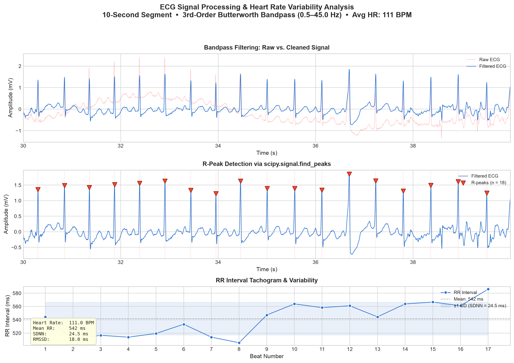

# ECG Signal Processing & Heart Rate Variability Analysis

A Python-based biomedical signal processing project that takes a raw electrocardiogram (ECG) signal, filters noise, detects heartbeats, calculates heart rate, and analyzes heart rate variability (HRV).

This project explores how mathematical and computational techniques can transform a raw physiological signal into meaningful measurements.

## Overview

The project follows a complete ECG signal-processing pipeline:

**Raw ECG → Bandpass Filtering → R-Peak Detection → RR Intervals → Heart Rate & HRV → Visualization**

The analysis uses a 10-second segment of SciPy's built-in ECG dataset, sampled at 360 Hz.

## Motivation

I have always been curious about how devices such as smartwatches can take a noisy electrical signal from the body and turn it into a heart rate measurement.

While learning Python and signal processing, I wanted to build a simplified version of this process myself. This project allowed me to connect concepts from mathematics, physics, biology, and programming in a practical application.

Rather than treating signal-processing functions as black boxes, I wanted to understand the underlying concepts — including the Nyquist frequency, digital filtering, peak detection, standard deviation, and root mean square calculations.

## Features

* **ECG Data Loading** — Uses SciPy's built-in ECG dataset.
* **Bandpass Filtering** — Applies a 3rd-order Butterworth filter from 0.5–40 Hz.
* **R-Peak Detection** — Detects heartbeats using `scipy.signal.find_peaks`.
* **Heart Rate Calculation** — Calculates instantaneous and average BPM from RR intervals.
* **HRV Analysis** — Calculates SDNN and RMSSD.
* **Visualization** — Generates a three-panel visualization of the raw/filtered ECG, detected R-peaks, and RR intervals.

## Technologies

| Technology | Purpose                                            |
| ---------- | -------------------------------------------------- |
| Python 3   | Core programming                                   |
| NumPy      | Numerical calculations and array operations        |
| SciPy      | ECG dataset, digital filtering, and peak detection |
| Matplotlib | Data visualization                                 |

## How the Pipeline Works

### 1. Load the ECG Signal

The project loads SciPy's built-in ECG recording.

The signal has a sampling frequency of **360 Hz**.

### 2. Extract a Segment

A 10-second segment from **30–40 seconds** of the recording is selected for analysis.

### 3. Filter the Signal

A 3rd-order Butterworth bandpass filter is applied between **0.5 and 40 Hz**.

This helps reduce baseline drift and high-frequency noise while preserving the main features of the ECG waveform.

### 4. Detect R-Peaks

R-peaks are detected using:

```python
scipy.signal.find_peaks
```

The algorithm uses a minimum distance between detected peaks and a height threshold to reduce false detections.

### 5. Calculate RR Intervals

The time difference between consecutive R-peaks gives the RR interval:

```text
RR interval = time between consecutive heartbeats
```

### 6. Calculate Heart Rate

Instantaneous heart rate is calculated using:

```text
BPM = 60 / RR interval
```

The average heart rate is then calculated from the detected intervals.

### 7. Calculate HRV

Two time-domain HRV metrics are calculated:

**SDNN**
The standard deviation of the RR intervals, representing overall variation in beat-to-beat timing.

**RMSSD**
The root mean square of successive differences between RR intervals, emphasizing short-term beat-to-beat variation.

## Results

The program generates a three-panel visualization:

1. **Raw vs. filtered ECG** — Shows the effect of bandpass filtering.
2. **R-peak detection** — Shows detected heartbeats on the filtered signal.
3. **RR interval tachogram** — Shows beat-to-beat interval variation and HRV statistics.



## Example Output

```text
Full ECG signal: 108000 samples at 360 Hz (300.0 seconds)
Extracted slice: 3600 samples (30s to 40s)
Applied 3rd-order Butterworth bandpass filter (0.5–40.0 Hz)
Detected 18 R-peaks
Average heart rate: 111.0 BPM
SDNN: 24.54 ms
RMSSD: 18.02 ms
```

*Example values are from the analyzed ECG segment and are included for demonstration.*

## Limitations

This project is intentionally simplified and has several limitations:

* **Short recording window** — A 10-second segment is useful for demonstrating the processing pipeline but is not ideal for comprehensive HRV analysis, particularly SDNN.
* **No artifact rejection** — Real ECG recordings can contain motion artifacts, ectopic beats, and other abnormalities.
* **Simple peak detection** — Fixed thresholds are used instead of more advanced algorithms such as Pan-Tompkins.
* **Single lead** — The dataset represents a single ECG lead rather than a clinical 12-lead ECG.
* **Time-domain HRV only** — Frequency-domain HRV analysis has not yet been implemented.

## Future Improvements

Possible extensions include:

* Implement the Pan-Tompkins algorithm for more robust R-peak detection
* Add frequency-domain HRV analysis
* Process the complete 5-minute recording
* Create Poincaré plots
* Add interactive filtering controls
* Support external ECG files such as CSV or EDF
* Add artifact and abnormal-beat detection
* Explore machine-learning approaches to ECG classification

## What I Learned

Through this project, I practiced:

* Digital signal processing
* Butterworth filter design
* The Nyquist theorem
* Second-order sections and numerical stability
* Peak detection
* Time-series analysis
* RR interval analysis
* Statistical calculations
* Biomedical data visualization
* Scientific Python development

Most importantly, I learned how mathematical concepts can be combined with programming to process real-world physiological data.

## Installation

### Requirements

* Python 3.8+
* NumPy
* SciPy
* Matplotlib

### Install dependencies

```bash
pip install numpy scipy matplotlib pooch
```

### Run the project

```bash
python ECG.py
```

The program will load the ECG dataset, perform the signal-processing pipeline, calculate heart rate and HRV metrics, and save the resulting visualization as:

```text
ecg_analysis_output.png
```

## Disclaimer

This is a student educational project and **not a medical device or diagnostic tool**.

The signal processing, peak detection, and HRV calculations are simplified implementations for learning purposes and have not been clinically validated. The results should not be used to make medical decisions or diagnose health conditions.
